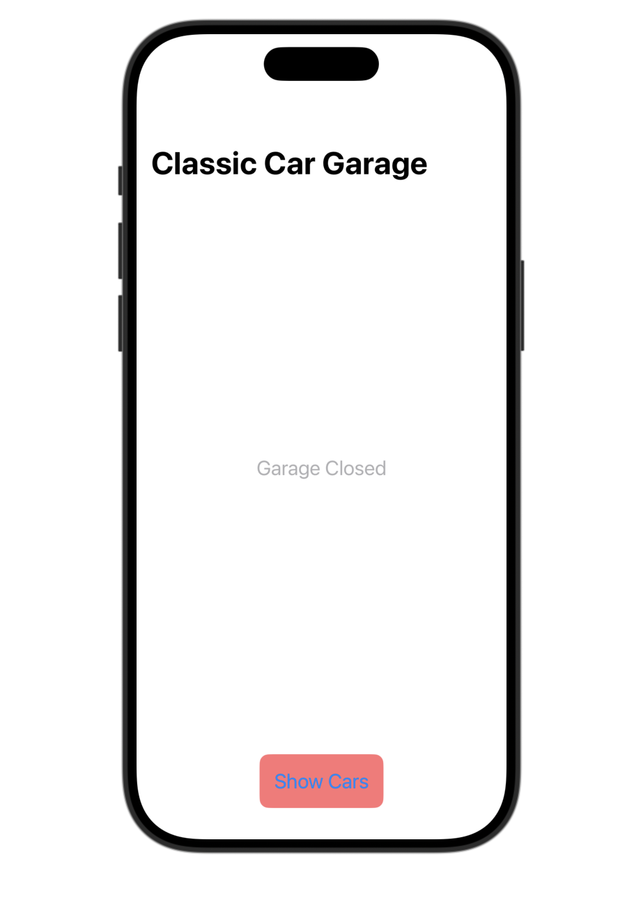
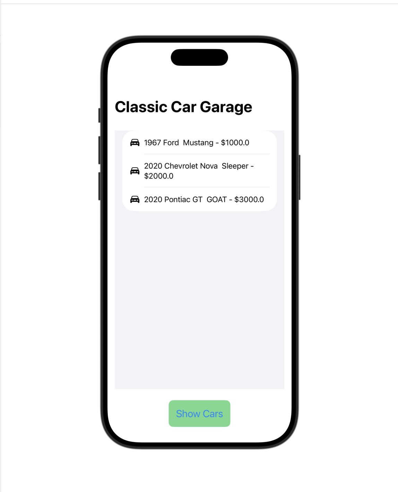

# Classic Car Garage

A SwiftUI application that displays a collection of classic cars using custom data models, state management, and interactive user interface components.

## Features

- Displays a collection of classic cars
- Shows vehicle information including year, name, nickname, and price
- Allows the user to show or hide the garage inventory
- Dynamically updates the interface based on application state
- Displays vehicle data using a SwiftUI `List`
- Uses SF Symbols to provide visual car icons

## Technical Concepts Demonstrated

- Swift
- SwiftUI
- Custom Data Models
- Structures (`struct`)
- `Identifiable`
- `UUID`
- Optionals
- Nil-Coalescing Operator (`??`)
- Computed Properties
- Arrays
- `@State` State Management
- `NavigationStack`
- `List` and `ForEach`
- Conditional UI Rendering
- Closures and `map`
- SwiftUI Views and Modifiers

## How It Works

The application uses a custom `ClassicCar` model to represent each vehicle. Each car stores information including its name, year, optional nickname, and price.

The app generates a collection of `ClassicCar` objects and stores them in an array. SwiftUI's `List` and `ForEach` are used to display the vehicles dynamically.

A button allows the user to open or close the garage by changing application state. When the garage is closed, the interface displays a "Garage Closed" message. When opened, the application displays the available vehicles.

## Purpose

This project was developed to strengthen my understanding of Swift and SwiftUI by combining data modeling with an interactive user interface. It demonstrates how application state and custom data models can be used together to dynamically update a SwiftUI application.

## Development Environment

- Swift
- SwiftUI
- Xcode
- macOS

## Author

**Erika Frison**

Software Engineering & Information Technology Student

## Screenshots

### Garage Closed

### Garage Open

